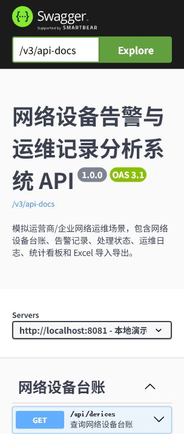
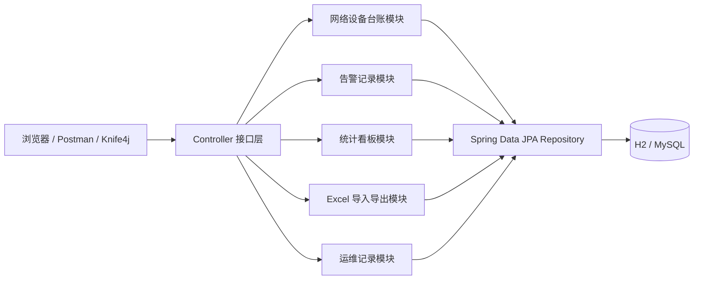

# 网络设备告警与运维记录分析系统

这是一个基于 Spring Boot 的网络设备告警与运维记录后端项目，模拟运营商云网运维、企业网络安全支撑和政企客户技术支持场景。项目围绕网络设备台账、告警事件、处理状态、运维记录、统计看板和 Excel 导入导出展开，用于练习后端接口开发、状态流转建模、数据导入导出和接口文档整理。



## 项目背景

运营商、国企和企业 IT 部门的技术支撑岗位，经常需要处理网络设备台账、告警记录、巡检记录和问题跟踪。本项目选取网络运维告警作为切入点，做一个小而完整的后端接口系统，用来展示基础开发、接口联调、运维记录和数据处理能力。

## 功能模块

- 网络设备台账：管理交换机、防火墙、无线控制器等设备的资产编号、管理 IP、状态和负责团队。
- 告警记录：记录告警等级、标题、描述、来源、发生时间和处理状态。
- 告警状态流转：支持从 `OPEN` 到 `PROCESSING`、`CLOSED` 的处理过程。
- 运维记录：记录设备录入、告警处理、Excel 导入等操作。
- 统计看板：统计设备总数、未处理告警、处理中告警、已关闭告警和设备状态分布。
- Excel 导入导出：设备台账支持导出为 Excel，也支持批量导入或更新。
- Swagger/Knife4j 接口文档：启动后可在网页中查看和调试接口。

## 系统模块图



## 技术栈

- Java 21
- Spring Boot 3.5.7
- Spring Web MVC
- Spring Data JPA
- Bean Validation
- H2 内存数据库
- MySQL 运行配置
- Apache POI 处理 Excel
- springdoc-openapi + Knife4j
- JUnit 5 + MockMvc

## 本地启动

默认使用 H2，不需要提前安装数据库：

```powershell
cd C:\Users\cbx\Documents\work1\network-alert-workbench
C:\Users\cbx\Tools\apache-maven-3.9.16\bin\mvn.cmd spring-boot:run
```

启动后打开：

- Knife4j 文档：[http://localhost:8081/doc.html](http://localhost:8081/doc.html)
- Swagger UI：[http://localhost:8081/swagger-ui.html](http://localhost:8081/swagger-ui.html)
- OpenAPI JSON：[http://localhost:8081/v3/api-docs](http://localhost:8081/v3/api-docs)
- 健康检查：[http://localhost:8081/api/health](http://localhost:8081/api/health)
- H2 控制台：[http://localhost:8081/h2-console](http://localhost:8081/h2-console)

H2 连接信息：

```text
JDBC URL: jdbc:h2:mem:network_alerts
User Name: sa
Password: 留空
```

## MySQL 版本运行

```sql
CREATE DATABASE network_alert_workbench DEFAULT CHARACTER SET utf8mb4 COLLATE utf8mb4_unicode_ci;
```

```powershell
$env:MYSQL_URL="jdbc:mysql://localhost:3306/network_alert_workbench?useUnicode=true&characterEncoding=utf8&serverTimezone=Asia/Shanghai&allowPublicKeyRetrieval=true&useSSL=false"
$env:MYSQL_USERNAME="root"
$env:MYSQL_PASSWORD="你的密码"
C:\Users\cbx\Tools\apache-maven-3.9.16\bin\mvn.cmd spring-boot:run "-Dspring-boot.run.profiles=mysql"
```

## 接口示例

健康检查：

```http
GET /api/health
```

查询设备台账：

```http
GET /api/devices
```

新增告警：

```http
POST /api/alerts
Content-Type: application/json
```

```json
{
  "deviceId": 1,
  "severity": "HIGH",
  "title": "链路丢包",
  "description": "上联链路出现丢包，需要检查端口和线路状态",
  "source": "巡检"
}
```

更新告警状态：

```http
PATCH /api/alerts/1/status
Content-Type: application/json
```

```json
{
  "status": "PROCESSING",
  "handler": "曹博轩"
}
```

导出设备台账 Excel：

```http
GET /api/devices/export
```

导入设备台账 Excel：

```powershell
curl.exe -F "file=@C:\Users\cbx\Desktop\network-devices.xlsx" http://localhost:8081/api/devices/import
```

仓库里提供了一份可直接测试的导入模板：

- [网络设备导入模板](docs/sample-network-devices-import.xlsx)

## 主要接口

| 方法 | 路径 | 说明 |
| --- | --- | --- |
| GET | `/api/health` | 健康检查 |
| GET | `/api/dashboard` | 统计看板 |
| GET | `/api/devices` | 查询网络设备台账 |
| POST | `/api/devices` | 新增网络设备 |
| PATCH | `/api/devices/{id}/status` | 更新设备状态 |
| GET | `/api/devices/export` | 导出设备 Excel |
| POST | `/api/devices/import` | 导入设备 Excel |
| GET | `/api/alerts` | 查询告警记录 |
| POST | `/api/alerts` | 新建告警 |
| PATCH | `/api/alerts/{id}/status` | 更新告警状态 |
| GET | `/api/operation-records` | 查询运维记录 |

## 测试说明

```powershell
C:\Users\cbx\Tools\apache-maven-3.9.16\bin\mvn.cmd test
```

当前测试覆盖：

- Spring Boot 上下文启动
- 健康检查接口
- 设备台账查询接口
- 告警创建接口
- 统计看板接口
- 设备台账 Excel 导出
- 设备台账 Excel 导入
- OpenAPI 接口文档生成

